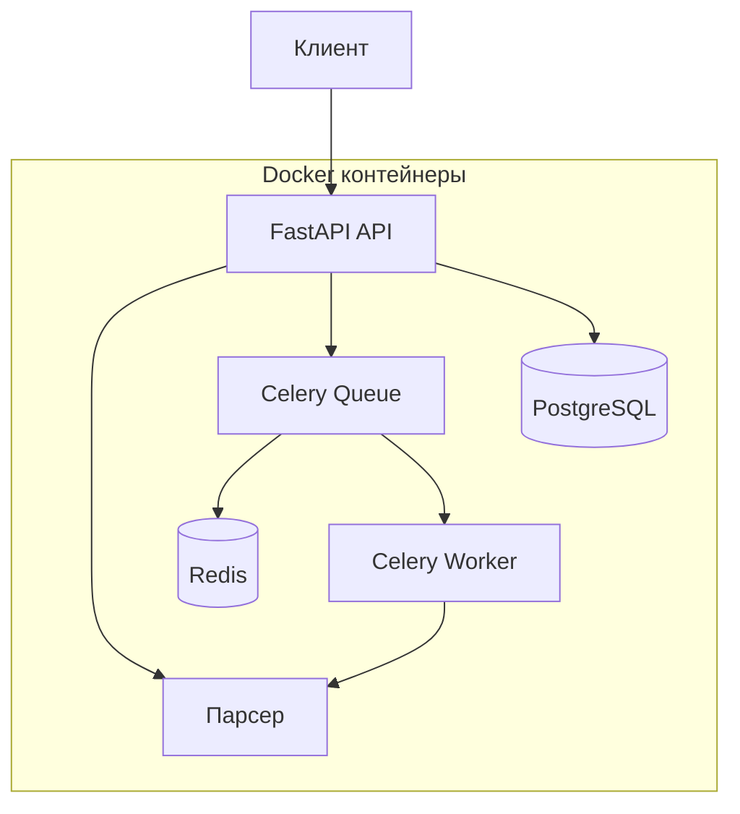

# Лабораторная работа 3 - Docker и Celery интеграция

## Обзор

Данная лабораторная работа демонстрирует создание контейнеризованного приложения с использованием Docker, Docker Compose и интеграции Celery с Redis для асинхронной обработки задач парсинга URL.

## Задачи лабораторной работы

### 🐳 Задача 1: Создание Dockerfile
- Создание Dockerfile для упаковки FastAPI приложения и парсера
- Указание базового образа и установка зависимостей
- Определение команды запуска приложения

### 🐙 Задача 2: Создание Docker Compose файла
- Написание docker-compose.yml для управления сервисами
- Определение FastAPI, базы данных и парсера
- Настройка зависимостей между сервисами

### 🌐 Задача 3: Создание эндпоинтов FastAPI для вызова парсера
- Добавление эндпоинта для получения запросов на парсинг URL
- Отправка запросов парсеру в отдельном контейнере
- Возврат результатов обработки клиенту

### ⚡ Задача 4: Интеграция Celery и Redis через очереди
- Настройка Celery для асинхронной обработки задач
- Использование Redis как брокера сообщений
- Реализация фоновой обработки задач парсинга

## Технологический стек

- **FastAPI** - веб-фреймворк для создания API
- **Docker** - контейнеризация приложений
- **Docker Compose** - оркестрация многоконтейнерных приложений
- **Celery** - асинхронная очередь задач
- **Redis** - брокер сообщений и хранилище данных
- **PostgreSQL** - реляционная база данных

## Быстрый старт

### Предварительные требования
- Docker и Docker Compose
- Python 3.11+
- Git

### Установка и запуск

1. **Клонирование репозитория**
```bash
git clone <repository-url>
cd lab3
```

2. **Запуск всех сервисов**
```bash
docker compose up -d
```

3. **Проверка статуса сервисов**
```bash
docker compose ps
```

4. **Доступ к приложению**
- Основное API: http://localhost:8000
- Документация API: http://localhost:8000/docs
- Парсер API: http://localhost:8001
- Redis: localhost:6379

## Структура документации

```
docs/
├── index.md                    # Главная страница
├── dockerfile/                 # Задача 1 - Dockerfile
│   └── creation.md            # Создание Dockerfile
├── docker-compose/            # Задача 2 - Docker Compose
│   └── creation.md           # Создание docker-compose.yml
├── fastapi/                   # Задача 3 - FastAPI и парсер
│   └── endpoints.md          # Создание эндпоинтов
├── celery/                    # Задача 4 - Celery
│   └── setup.md              # Настройка Celery
└── redis/                     # Задача 4 - Redis
    └── setup.md              # Настройка Redis
```

## Основные эндпоинты

### Синхронный парсинг
```http
POST /api/v1/parser/parse-urls
Content-Type: application/json

{
  "urls": ["https://example.com", "https://httpbin.org/html"],
  "mode": "asyncio"
}
```

### Асинхронный парсинг через Celery
```http
POST /api/v1/async-parser/parse-urls-async
Content-Type: application/json

{
  "urls": ["https://example.com", "https://httpbin.org/html"],
  "mode": "asyncio"
}
```

### Проверка статуса задачи
```http
GET /api/v1/async-parser/task-status/{task_id}
```

## Запуск документации

### Установка MkDocs
```bash
pip install -r requirements-mkdocs.txt
```

### Запуск сервера разработки
```bash
mkdocs serve
```

### Альтернативный запуск
```bash
chmod +x start_mkdocs.sh
./start_mkdocs.sh
```

Документация будет доступна по адресу: http://localhost:8000

## Мониторинг и отладка

### Логи сервисов
```bash
# Логи всех сервисов
docker compose logs -f

# Логи конкретного сервиса
docker compose logs -f celery-worker
docker compose logs -f redis
```

### Проверка здоровья сервисов
```bash
# Проверка Redis
docker compose exec redis redis-cli ping

# Проверка Celery воркеров
docker compose exec celery-worker celery -A app.celery_app inspect active
```

## Архитектура системы



## Принцип работы

1. **Клиент** отправляет HTTP запрос в FastAPI
2. **FastAPI** создает Celery задачу и отправляет её в Redis
3. **Redis** хранит задачу в очереди
4. **Celery Worker** получает задачу из Redis и выполняет её
5. **Результат** сохраняется обратно в Redis
6. **Клиент** может получить результат по task_id

## Следующие шаги

1. 📖 Изучите [создание Dockerfile](docs/dockerfile/creation.md)
2. 🔧 Настройте [Docker Compose](docs/docker-compose/creation.md)
3. 🌐 Создайте [эндпоинты FastAPI](docs/fastapi/endpoints.md)
4. ⚡ Интегрируйте [Celery и Redis](docs/celery/setup.md)

---

*Документация создана с использованием MkDocs и Material for MkDocs*