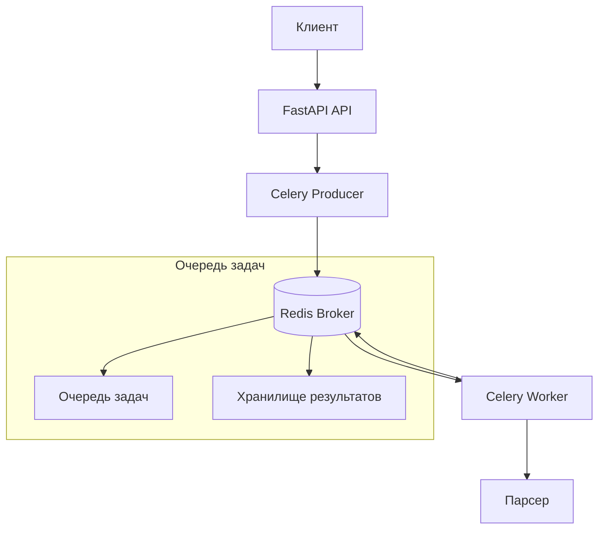

# Настройка Celery и Redis

## Обзор

Celery - это асинхронная очередь задач для Python, которая позволяет выполнять задачи в фоновом режиме. Redis используется как брокер сообщений для хранения задач, ожидающих выполнения. В данной лабораторной работе мы настроим интеграцию Celery с Redis для асинхронной обработки задач парсинга URL.

## Принцип работы Celery и Redis

### Архитектура системы



### Как это работает

1. **Клиент** отправляет HTTP запрос в FastAPI
2. **FastAPI** создает Celery задачу и отправляет её в Redis
3. **Redis** хранит задачу в очереди
4. **Celery Worker** получает задачу из Redis и выполняет её
5. **Результат** сохраняется обратно в Redis
6. **Клиент** может получить результат по task_id

## Установка зависимостей

### requirements.txt

```txt
# requirements.txt
fastapi==0.115.13
uvicorn==0.34.0
celery==5.3.4
redis==5.0.1
httpx==0.28.1
pydantic==2.9.2
python-dotenv==1.0.1
```

### Объяснение зависимостей

- **celery==5.3.4**: Основная библиотека для асинхронных задач
- **redis==5.0.1**: Клиент Redis для Python
- **httpx==0.28.1**: HTTP клиент для парсинга URL
- **python-dotenv==1.0.1**: Загрузка переменных окружения из .env файла

## Конфигурация Celery

### Основной файл конфигурации Celery

```python
# app/celery_app.py
"""
Конфигурация Celery приложения
"""
from celery import Celery
from app.core.config import settings
import os

# Создание экземпляра Celery
celery_app = Celery(
    "lab3_parser",
    broker=settings.REDIS_URL,
    backend=settings.REDIS_URL,
    include=["app.tasks.parser_tasks"]
)

# Конфигурация Celery
celery_app.conf.update(
    # Настройки сериализации
    task_serializer="json",
    accept_content=["json"],
    result_serializer="json",
    
    # Настройки времени
    timezone="UTC",
    enable_utc=True,
    
    # Настройки задач
    task_track_started=True,
    task_time_limit=30 * 60,  # 30 минут максимальное время выполнения
    task_soft_time_limit=25 * 60,  # 25 минут мягкий лимит
    
    # Настройки воркера
    worker_prefetch_multiplier=1,
    worker_max_tasks_per_child=1000,
    
    # Настройки результата
    result_expires=3600,  # Результаты хранятся 1 час
    result_persistent=True,
    
    # Настройки Redis
    result_backend_transport_options={
        'master_name': 'mymaster',
    },
)

# Маршрутизация задач
celery_app.conf.task_routes = {
    "app.tasks.parser_tasks.*": {"queue": "parser_queue"},
}

# Определение очередей
celery_app.conf.task_default_queue = "default"
celery_app.conf.task_queues = {
    "default": {
        "exchange": "default",
        "routing_key": "default",
    },
    "parser_queue": {
        "exchange": "parser",
        "routing_key": "parser",
    },
}

if __name__ == "__main__":
    celery_app.start()
```

### Объяснение конфигурации

**broker и backend**:
- `broker`: Redis URL для отправки задач
- `backend`: Redis URL для хранения результатов

**task_serializer**:
- Использует JSON для сериализации задач
- Обеспечивает совместимость между различными языками

**task_track_started**:
- Отслеживает начало выполнения задач
- Позволяет мониторить прогресс

**task_time_limit**:
- Максимальное время выполнения задачи
- Предотвращает зависание воркеров

**worker_prefetch_multiplier**:
- Количество задач для предварительной загрузки
- Значение 1 означает загрузку по одной задаче

## Определение задач

### Основной файл задач

```python
# app/tasks/parser_tasks.py
"""
Определения Celery задач для парсинга URL
"""
import asyncio
import httpx
from typing import List, Dict, Any
from celery import current_task
from app.celery_app import celery_app
import logging
import time

logger = logging.getLogger(__name__)

@celery_app.task(bind=True, name="parse_urls_async")
def parse_urls_task(self, urls: List[str], mode: str = "asyncio") -> Dict[str, Any]:
    """
    Асинхронная задача парсинга URL
    
    Args:
        urls: Список URL для парсинга
        mode: Режим парсинга (asyncio, threading, multiprocessing)
    
    Returns:
        Результат парсинга
    """
    try:
        logger.info(f"Начало выполнения задачи {self.request.id}")
        
        # Обновление статуса задачи
        self.update_state(
            state="PROGRESS",
            meta={
                "current": 0,
                "total": len(urls),
                "status": f"Начинаем парсинг {len(urls)} URL"
            }
        )
        
        start_time = time.time()
        
        # Выбор метода парсинга в зависимости от режима
        if mode == "asyncio":
            result = asyncio.run(_parse_urls_asyncio(urls, self))
        elif mode == "threading":
            result = _parse_urls_threading(urls, self)
        elif mode == "multiprocessing":
            result = _parse_urls_multiprocessing(urls, self)
        else:
            raise ValueError(f"Неподдерживаемый режим парсинга: {mode}")
        
        end_time = time.time()
        result["total_time"] = end_time - start_time
        
        # Обновление финального статуса
        self.update_state(
            state="SUCCESS",
            meta={
                "current": len(urls),
                "total": len(urls),
                "status": "Парсинг завершен",
                "result": result
            }
        )
        
        logger.info(f"Задача {self.request.id} выполнена успешно за {result['total_time']:.2f} секунд")
        
        return result
        
    except Exception as e:
        logger.error(f"Ошибка выполнения задачи {self.request.id}: {str(e)}")
        
        # Обновление статуса при ошибке
        self.update_state(
            state="FAILURE",
            meta={
                "error": str(e),
                "status": "Задача завершена с ошибкой"
            }
        )
        
        raise

async def _parse_urls_asyncio(urls: List[str], task) -> Dict[str, Any]:
    """
    Парсинг URL с использованием asyncio
    """
    results = []
    total_urls = len(urls)
    
    async with httpx.AsyncClient(timeout=30.0) as client:
        for i, url in enumerate(urls):
            try:
                # Обновление прогресса
                task.update_state(
                    state="PROGRESS",
                    meta={
                        "current": i + 1,
                        "total": total_urls,
                        "status": f"Парсинг: {url}"
                    }
                )
                
                # HTTP запрос
                response = await client.get(url)
                
                # Извлечение заголовка
                title = _extract_title(response.text)
                
                result = {
                    "url": url,
                    "status_code": response.status_code,
                    "title": title,
                    "content_length": len(response.text),
                    "success": True
                }
                
            except Exception as e:
                result = {
                    "url": url,
                    "error": str(e),
                    "success": False
                }
            
            results.append(result)
    
    return {
        "mode": "asyncio",
        "total_urls": total_urls,
        "successful": sum(1 for r in results if r.get("success", False)),
        "failed": sum(1 for r in results if not r.get("success", False)),
        "results": results
    }

def _extract_title(content: str) -> str:
    """Извлечение заголовка из HTML"""
    import re
    title_match = re.search(r'<title>(.*?)</title>', content, re.IGNORECASE)
    return title_match.group(1) if title_match else "Без заголовка"
```

## Конфигурация Redis

### Настройки Redis в Docker Compose

```yaml
# docker-compose.yml
services:
  redis:
    image: redis:7-alpine
    container_name: lab3-redis
    restart: unless-stopped
    ports:
      - "6379:6379"
    volumes:
      - redis_data:/data
    networks:
      - app-network
    command: redis-server --appendonly yes --maxmemory 512mb --maxmemory-policy allkeys-lru
    healthcheck:
      test: ["CMD", "redis-cli", "ping"]
      interval: 10s
      timeout: 5s
      retries: 5
      start_period: 10s
```

### Объяснение настроек Redis

**--appendonly yes**:
- Включает AOF (Append Only File) для персистентности
- Обеспечивает сохранность данных при перезапуске

**--maxmemory 512mb**:
- Ограничивает использование памяти
- Предотвращает переполнение памяти

**--maxmemory-policy allkeys-lru**:
- Политика вытеснения при достижении лимита памяти
- Удаляет наименее используемые ключи

## Запуск Celery воркеров

### Команды запуска

**Воркер**:
```bash
celery -A app.celery_app worker --loglevel=info --concurrency=4
```

**Beat (планировщик)**:
```bash
celery -A app.celery_app beat --loglevel=info
```

**Flower (мониторинг)**:
```bash
celery -A app.celery_app flower --port=5555
```

### Docker Compose конфигурация

```yaml
# docker-compose.yml
services:
  celery-worker:
    build:
      context: ./lab1
      dockerfile: Dockerfile
    container_name: lab3-celery-worker
    restart: unless-stopped
    environment:
      - REDIS_URL=redis://redis:6379/0
      - DATABASE_URL=postgresql://postgres:221bbs@db:5432/appdb
    depends_on:
      redis:
        condition: service_healthy
    networks:
      - app-network
    volumes:
      - ./lab1:/app
    command: celery -A app.celery_app worker --loglevel=info --concurrency=4

  celery-beat:
    build:
      context: ./lab1
      dockerfile: Dockerfile
    container_name: lab3-celery-beat
    restart: unless-stopped
    environment:
      - REDIS_URL=redis://redis:6379/0
      - DATABASE_URL=postgresql://postgres:221bbs@db:5432/appdb
    depends_on:
      redis:
        condition: service_healthy
    networks:
      - app-network
    volumes:
      - ./lab1:/app
    command: celery -A app.celery_app beat --loglevel=info
```

## Интеграция с FastAPI

### Создание эндпоинтов для работы с Celery

```python
# app/api/v1/async_parser.py
from fastapi import APIRouter, HTTPException
from app.schemas.parser import URLParseRequest
from app.tasks.parser_tasks import parse_urls_task
from celery.result import AsyncResult
import logging

logger = logging.getLogger(__name__)
router = APIRouter()

class TaskStatusResponse(BaseModel):
    """Ответ со статусом задачи"""
    task_id: str
    status: str
    result: Optional[Dict[str, Any]] = None
    error: Optional[str] = None
    progress: Optional[Dict[str, Any]] = None

@router.post("/parse-urls-async", response_model=TaskStatusResponse)
async def parse_urls_async(request: URLParseRequest):
    """
    Запуск асинхронного парсинга URL
    
    Создает Celery задачу и возвращает task_id для отслеживания
    """
    try:
        # Валидация входных данных
        for url in request.urls:
            if not url.startswith(("http://", "https://")):
                raise HTTPException(
                    status_code=400,
                    detail=f"Неверный формат URL: {url}"
                )
        
        logger.info(f"Запуск асинхронного парсинга {len(request.urls)} URL")
        
        # Создание Celery задачи
        task = parse_urls_task.delay(request.urls, request.mode)
        
        logger.info(f"Задача создана с ID: {task.id}")
        
        return TaskStatusResponse(
            task_id=task.id,
            status="PENDING",
            result=None,
            error=None,
            progress=None
        )
        
    except Exception as e:
        logger.error(f"Ошибка создания задачи: {str(e)}")
        raise HTTPException(
            status_code=500,
            detail=f"Не удалось создать задачу: {str(e)}"
        )

@router.get("/task-status/{task_id}", response_model=TaskStatusResponse)
async def get_task_status(task_id: str):
    """
    Получение статуса задачи
    
    Возвращает текущий статус и результат выполнения задачи
    """
    try:
        # Получение результата задачи
        result = AsyncResult(task_id, app=parse_urls_task.app)
        
        response = TaskStatusResponse(
            task_id=task_id,
            status=result.status
        )
        
        # Обработка различных состояний задачи
        if result.status == "SUCCESS":
            response.result = result.result
            if isinstance(result.result, dict) and "progress" in result.result:
                response.progress = result.result["progress"]
        elif result.status == "FAILURE":
            response.error = str(result.info)
        elif result.status == "PROGRESS":
            response.progress = result.info
        elif result.status == "PENDING":
            response.progress = {"status": "Задача ожидает выполнения..."}
        
        return response
        
    except Exception as e:
        logger.error(f"Ошибка получения статуса задачи: {str(e)}")
        raise HTTPException(
            status_code=500,
            detail=f"Не удалось получить статус задачи: {str(e)}"
        )

@router.get("/celery-stats")
async def get_celery_stats():
    """
    Получение статистики Celery
    
    Возвращает информацию о воркерах и очередях
    """
    try:
        from app.celery_app import celery_app
        
        # Получение информации о воркерах
        inspect = celery_app.control.inspect()
        active_tasks = inspect.active()
        registered_tasks = inspect.registered()
        stats = inspect.stats()
        
        # Подсчет активных задач
        total_active = sum(len(tasks) for tasks in active_tasks.values()) if active_tasks else 0
        
        # Информация о воркерах
        worker_info = {}
        if active_tasks:
            for worker, tasks in active_tasks.items():
                worker_stats = stats.get(worker, {})
                worker_info[worker] = {
                    "status": "online",
                    "active_tasks": len(tasks),
                    "processed": worker_stats.get("total", {}).get("tasks.succeeded", 0),
                    "failed": worker_stats.get("total", {}).get("tasks.failed", 0)
                }
        
        return {
            "active_tasks": total_active,
            "registered_tasks": list(set().union(*registered_tasks.values())) if registered_tasks else [],
            "workers": worker_info
        }
        
    except Exception as e:
        logger.error(f"Ошибка получения статистики Celery: {str(e)}")
        raise HTTPException(
            status_code=500,
            detail=f"Не удалось получить статистику: {str(e)}"
        )
```

## Мониторинг и отладка

### Проверка состояния Redis

```bash
# Подключение к Redis CLI
docker compose exec redis redis-cli

# Основные команды
INFO                    # Общая информация
INFO memory            # Информация о памяти
INFO clients           # Информация о клиентах
MONITOR                # Мониторинг команд в реальном времени

# Проверка очередей Celery
KEYS celery*          # Все ключи Celery
LLEN celery           # Длина очереди
```

### Проверка состояния Celery

```bash
# Подключение к воркеру
docker compose exec celery-worker bash

# Проверка активных задач
celery -A app.celery_app inspect active

# Проверка зарегистрированных задач
celery -A app.celery_app inspect registered

# Статистика воркеров
celery -A app.celery_app inspect stats

# Проверка очередей
celery -A app.celery_app inspect reserved
```

### Логирование

```python
# app/core/logging.py
import logging
import sys

def setup_celery_logging():
    """Настройка логирования для Celery"""
    
    # Форматтер для логов
    formatter = logging.Formatter(
        '%(asctime)s - %(name)s - %(levelname)s - %(message)s'
    )
    
    # Настройка логгера Celery
    celery_logger = logging.getLogger('celery')
    celery_logger.setLevel(logging.INFO)
    
    # Консольный обработчик
    console_handler = logging.StreamHandler(sys.stdout)
    console_handler.setFormatter(formatter)
    celery_logger.addHandler(console_handler)
    
    # Файловый обработчик
    file_handler = logging.FileHandler('logs/celery.log')
    file_handler.setFormatter(formatter)
    celery_logger.addHandler(file_handler)
    
    return celery_logger

# Инициализация логирования
celery_logger = setup_celery_logging()
```

## Обработка ошибок

### Retry механизм

```python
# app/tasks/parser_tasks.py
@celery_app.task(
    bind=True, 
    autoretry_for=(Exception,), 
    retry_kwargs={'max_retries': 3, 'countdown': 60}
)
def parse_url_with_retry(self, url: str):
    """
    Задача парсинга с автоматическими повторами
    """
    try:
        # Логика парсинга
        result = parse_single_url(url)
        return result
    except Exception as exc:
        # Автоматический повтор
        raise self.retry(exc=exc)
```

### Обработка исключений

```python
# app/tasks/parser_tasks.py
@celery_app.task(bind=True)
def safe_parse_task(self, urls: List[str]):
    """
    Безопасное выполнение задачи с обработкой исключений
    """
    try:
        return parse_urls_task(urls)
    except Exception as exc:
        # Логирование ошибки
        logger.error(f"Задача {self.request.id} завершена с ошибкой: {exc}")
        
        # Обновление статуса
        self.update_state(
            state='FAILURE',
            meta={'error': str(exc)}
        )
        
        # Повторное возбуждение исключения
        raise
```

## Производительность и оптимизация

### Настройки производительности

```python
# app/celery_app.py
celery_app.conf.update(
    # Оптимизация для I/O задач
    worker_pool='eventlet',
    worker_concurrency=1000,
    
    # Оптимизация сериализации
    task_serializer='pickle',
    accept_content=['pickle', 'json'],
    result_serializer='pickle',
    
    # Настройки результата
    result_expires=3600,
    result_persistent=True,
    
    # Оптимизация prefetch
    worker_prefetch_multiplier=4,
)
```

### Масштабирование воркеров

```bash
# Запуск дополнительных воркеров
docker compose up -d --scale celery-worker=3

# Проверка количества воркеров
docker compose ps | grep celery-worker
```

## Тестирование

### Тест Celery задач

```python
# tests/test_celery_tasks.py
import pytest
from app.tasks.parser_tasks import parse_urls_task

@pytest.mark.celery
def test_parse_urls_task():
    """Тест задачи парсинга URL"""
    urls = ["https://httpbin.org/html", "https://httpbin.org/json"]
    
    result = parse_urls_task.delay(urls, "asyncio")
    
    # Ожидание завершения задачи
    task_result = result.get(timeout=30)
    
    assert task_result["mode"] == "asyncio"
    assert task_result["total_urls"] == 2
    assert len(task_result["results"]) == 2
```

### Тест интеграции с FastAPI

```python
# tests/test_async_api.py
import pytest
from fastapi.testclient import TestClient
from app.main import app

client = TestClient(app)

def test_async_parse_endpoint():
    """Тест асинхронного эндпоинта парсинга"""
    response = client.post(
        "/api/v1/async-parser/parse-urls-async",
        json={
            "urls": ["https://httpbin.org/html"],
            "mode": "asyncio"
        }
    )
    
    assert response.status_code == 200
    data = response.json()
    assert "task_id" in data
    assert data["status"] == "PENDING"
```
