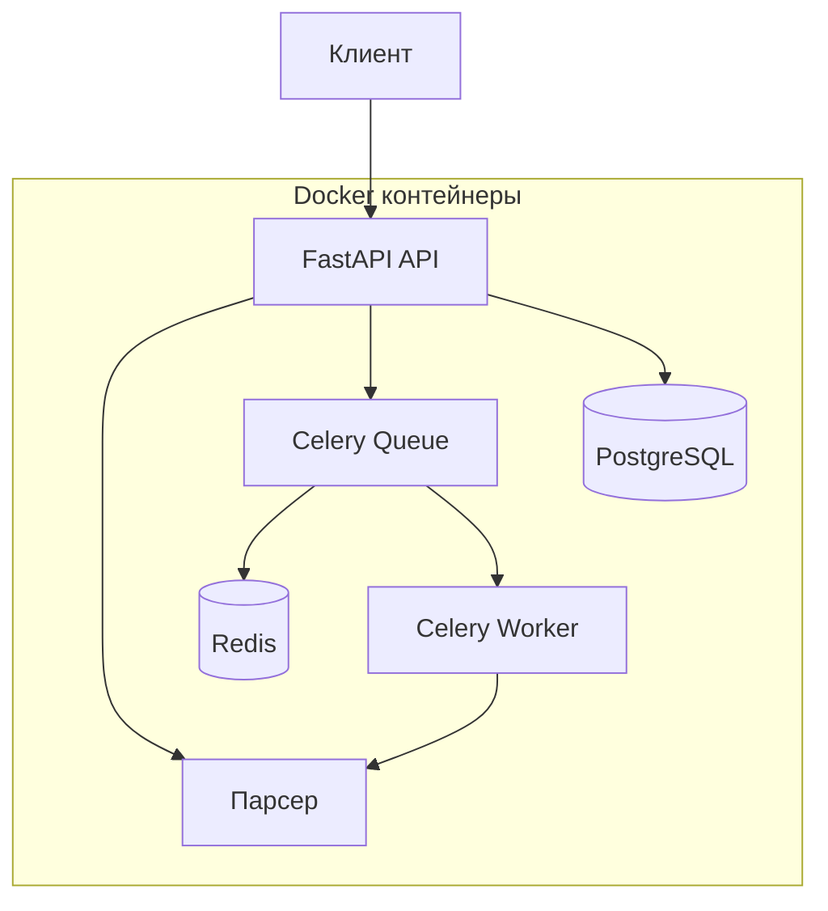

# Лабораторная работа 3 - Docker и Celery интеграция

## Обзор проекта

Данная лабораторная работа демонстрирует создание контейнеризованного приложения с использованием Docker, Docker Compose и интеграции Celery с Redis для асинхронной обработки задач парсинга URL.

## Задачи лабораторной работы

### Задача 1: Создание Dockerfile

**Цель**: Создать Dockerfile для упаковки FastAPI приложения и парсера в контейнеры.

**Что нужно сделать**:
- Указать базовый образ
- Установить необходимые зависимости
- Скопировать исходный код в контейнер
- Определить команду запуска приложения

**Причина**: Docker позволяет упаковать приложение и все его зависимости в независимый контейнер, что обеспечивает консистентность среды выполнения и упрощает процесс развертывания.

### Задача 2: Создание Docker Compose файла

**Цель**: Написать docker-compose.yml файл для управления кластером сервисов.

**Что нужно сделать**:
- Определить все сервисы (FastAPI, база данных, парсер)
- Указать порты для каждого сервиса
- Настроить зависимости между сервисами

**Причина**: Docker Compose упрощает управление несколькими контейнерами, позволяя запускать и настраивать все сервисы приложения через единый файл конфигурации.

### Задача 3: Создание эндпоинтов FastAPI для вызова парсера

**Цель**: Добавить в FastAPI приложение эндпоинт для вызова парсера.

**Что нужно сделать**:
- Создать эндпоинт для получения запросов на парсинг URL
- Отправить запросы парсеру (работающему в отдельном контейнере)
- Вернуть результаты обработки клиенту

**Причина**: Это позволяет интегрировать функциональность парсера в веб-приложение, предоставляя пользователям возможность запускать парсинг через API.

### Задача 4: Интеграция Celery и Redis через очереди

**Цель**: Реализовать асинхронную обработку задач с использованием Celery и Redis.

**Принцип работы**:
- **Celery** - асинхронная очередь задач для распределения и выполнения фоновых задач
- **Redis** - брокер сообщений для хранения задач, ожидающих выполнения
- При получении HTTP запроса задача помещается в очередь Redis, а Celery worker обрабатывает её в фоновом режиме

**Docker Compose интеграция**:
Docker Compose упрощает настройку и запуск Celery, Redis и FastAPI приложения как отдельных контейнеров в одной сети, что упрощает управление зависимостями и конфигурацией всех компонентов системы.

## Технологический стек

- **FastAPI** - современный веб-фреймворк для создания API
- **Docker** - контейнеризация приложений
- **Docker Compose** - оркестрация многоконтейнерных приложений
- **Celery** - асинхронная очередь задач
- **Redis** - брокер сообщений и хранилище данных
- **PostgreSQL** - реляционная база данных

## Архитектура системы



## Структура проекта

```
lab3/
├── lab1/                    # Основное приложение
│   ├── app/
│   │   ├── api/            # API эндпоинты
│   │   ├── celery_app.py   # Конфигурация Celery
│   │   └── tasks/          # Определения задач
│   ├── Dockerfile          # Образ приложения
│   └── requirements.txt    # Зависимости Python
├── docker-compose.yml      # Конфигурация Docker Compose
└── docs/                   # Документация MkDocs
```

## Быстрый старт

### Предварительные требования
- Docker и Docker Compose
- Python 3.11+
- Git

### Установка и запуск

1. **Клонирование репозитория**
```bash
git clone <repository-url>
cd lab3
```

2. **Запуск всех сервисов**
```bash
docker compose up -d
```

3. **Проверка статуса сервисов**
```bash
docker compose ps
```

4. **Доступ к приложению**
- Основное API: http://localhost:8000
- Документация API: http://localhost:8000/docs
- Парсер API: http://localhost:8001
- Redis: localhost:6379

## Основные эндпоинты

### Синхронный парсинг
```http
POST /api/v1/parser/parse-urls
Content-Type: application/json

{
  "urls": ["https://example.com", "https://httpbin.org/html"],
  "mode": "asyncio"
}
```

### Асинхронный парсинг через Celery
```http
POST /api/v1/async-parser/parse-urls-async
Content-Type: application/json

{
  "urls": ["https://example.com", "https://httpbin.org/html"],
  "mode": "asyncio"
}
```

### Проверка статуса задачи
```http
GET /api/v1/async-parser/task-status/{task_id}
```

## Мониторинг и отладка

### Логи сервисов
```bash
# Логи всех сервисов
docker compose logs -f

# Логи конкретного сервиса
docker compose logs -f celery-worker
docker compose logs -f redis
```

### Проверка здоровья сервисов
```bash
# Проверка Redis
docker compose exec redis redis-cli ping

# Проверка Celery воркеров
docker compose exec celery-worker celery -A app.celery_app inspect active
```

## Следующие шаги

1. Изучите [создание Dockerfile](dockerfile/creation.md)
2. Настройте [Docker Compose](docker-compose/creation.md)
3. Создайте [эндпоинты FastAPI](fastapi/endpoints.md)
4. Интегрируйте [Celery и Redis](celery/setup.md)

---

*Документация создана с использованием MkDocs и Material for MkDocs*
